## Database ERD (generated from migrations)

The diagram below shows the main tables and relationships derived from the project's migrations.

```mermaid
erDiagram
    USERS {
        int id PK
        string username
        string name
        string email
    }

    ROLES {
        int id PK
        string name
    }

    ROLE_USER {
        int user_id FK
        int role_id FK
    }

    BRANCHES {
        int id PK
        string name
    }

    BRANCH_USER {
        int user_id FK
        int branch_id FK
    }

    CATEGORIES {
        int id PK
        string name
    }

    SUBCATEGORIES {
        int id PK
        string name
        int category_id FK
    }

    PRODUCTS {
        int id PK
        string name
        int category_id FK
        int subcategory_id FK
    }

    COMPONENTS {
        int id PK
        string name
        int category_id FK
        int subcategory_id FK
        int supplier_id FK
    }

    RECIPES {
        int id PK
        int product_id FK
        int component_id FK
    }

    UNITS {
        int id PK
        string name
    }

    ORDERS {
        int id PK
        int user_id FK
        int table_no
        int number_pax
        string status
    }

    ORDER_DETAILS {
        int id PK
        int order_id FK
        int product_id FK
    }

    ORDER_ITEMS {
        int id PK
        int order_id FK
        int product_id FK
        int order_detail_id FK
    }

    DISCOUNTS {
        int id PK
        int created_by FK
    }

    DISCOUNT_ENTRIES {
        int id PK
        int order_id FK
        int discount_id FK
    }

    CUSTOMERS {
        int id PK
        int discount_id FK
    }

    PAYMENTS {
        int id PK
        int created_by FK
    }

    PAYMENT_DETAILS {
        int id PK
        int payment_id FK
        int cash_equivalent_id FK
        int order_id FK
    }

    CASH_EQUIVALENTS {
        int id PK
        int created_by FK
    }

    POS_SESSIONS {
        int id PK
        int branch_id FK
        int cashier_id FK
    }

    SUPPLIERS {
        int id PK
        string name
    }

    INVENTORY_PURCHASE_ORDERS {
        int id PK
        int user_id FK
        int supplier_id FK
    }

    PO_DETAILS {
        int id PK
        int inventory_purchase_order_id FK
        int component_id FK
    }

    PO_DELIVERY {
        int id PK
    }

    PO_DETAIL_RECEIPTS {
        int id PK
        int po_detail_id FK
    }

    INVENTORY_DEDUCTIONS {
        int id PK
        int component_id FK
        int order_detail_id FK
        int user_id FK
    }

    INVENTORY_AUDITS {
        int id PK
        int audited_by FK
    }

    INVENTORY_AUDIT_ITEMS {
        int id PK
        int inventory_audit_id FK
        int product_id FK
    }

    ACCOUNTING_CATEGORIES {
        int id PK
    }

    ACCOUNT_PAYABLES {
        int id PK
    }

    ACCOUNT_PAYABLE_DETAILS {
        int id PK
        int account_payable_id FK
        int accounting_category_id FK
    }

    ACCOUNTS_RECEIVABLES {
        int id PK
        int user_id FK
        int branch_id FK
    }

    ACCOUNTS_RECEIVABLE_DETAILS {
        int id PK
        int accounts_receivable_id FK
    }

    ACCOUNTS_RECEIVABLES_PAYMENTS {
        int id PK
        int account_receivable_id FK
        int cash_equivalent_id FK
        int payment_method_id FK
    }

    TAXES {
        int id PK
        int created_by FK
    }

    FUND_TRANSFERS {
        int id PK
        int created_by FK
        int from_cash_equivalent_id FK
        int to_cash_equivalent_id FK
    }

    REMARKS {
        int id PK
        int product_id FK
        int component_id FK
        int user_id FK
    }

    %% relationships
    USERS ||--o{ ORDERS : places
    USERS ||--o{ PAYMENTS : creates
    USERS ||--o{ REMARKS : writes
    USERS ||--o{ BRANCH_USER : assigned_to

    ROLES ||--o{ ROLE_USER : has
    USERS ||--o{ ROLE_USER : assigned

    BRANCHES ||--o{ BRANCH_USER : has
    BRANCHES ||--o{ POS_SESSIONS : hosts

    CATEGORIES ||--o{ SUBCATEGORIES : has
    CATEGORIES ||--o{ PRODUCTS : contains
    SUBCATEGORIES ||--o{ PRODUCTS : contains

    PRODUCTS ||--o{ RECIPES : has
    COMPONENTS ||--o{ RECIPES : used_in

    PRODUCTS ||--o{ ORDER_DETAILS : included_in
    ORDERS ||--o{ ORDER_DETAILS : contains
    ORDERS ||--o{ ORDER_ITEMS : contains
    ORDER_DETAILS ||--o{ ORDER_ITEMS : has

    DISCOUNTS ||--o{ DISCOUNT_ENTRIES : applied_to
    ORDERS ||--o{ DISCOUNT_ENTRIES : includes

    PAYMENTS ||--o{ PAYMENT_DETAILS : contains
    CASH_EQUIVALENTS ||--o{ PAYMENT_DETAILS : used_in

    INVENTORY_PURCHASE_ORDERS ||--o{ PO_DETAILS : contains
    PO_DETAILS ||--o{ PO_DETAIL_RECEIPTS : has

    INVENTORY_AUDITS ||--o{ INVENTORY_AUDIT_ITEMS : contains

    ACCOUNT_PAYABLES ||--o{ ACCOUNT_PAYABLE_DETAILS : has
    ACCOUNTS_RECEIVABLES ||--o{ ACCOUNTS_RECEIVABLE_DETAILS : has
    ACCOUNTS_RECEIVABLES ||--o{ ACCOUNTS_RECEIVABLES_PAYMENTS : receives

    CASH_EQUIVALENTS ||--o{ FUND_TRANSFERS : used_as

    COMPONENTS ||--o{ PO_DETAILS : purchased_as
    COMPONENTS ||--o{ INVENTORY_DEDUCTIONS : deducted_by

```

Notes:
- This ERD was generated by extracting table creation and foreign-key lines from the migrations.
- Some pivot or permission tables (from Spatie's permission package) use dynamic names; they are represented conceptually by `ROLES` and `ROLE_USER` here.
- If you want a PNG/SVG export I can render this Mermaid diagram and add the image to `docs/`.

If you'd like, I can tune column lists, include more tables, or break the ERD into smaller diagrams for readability.
